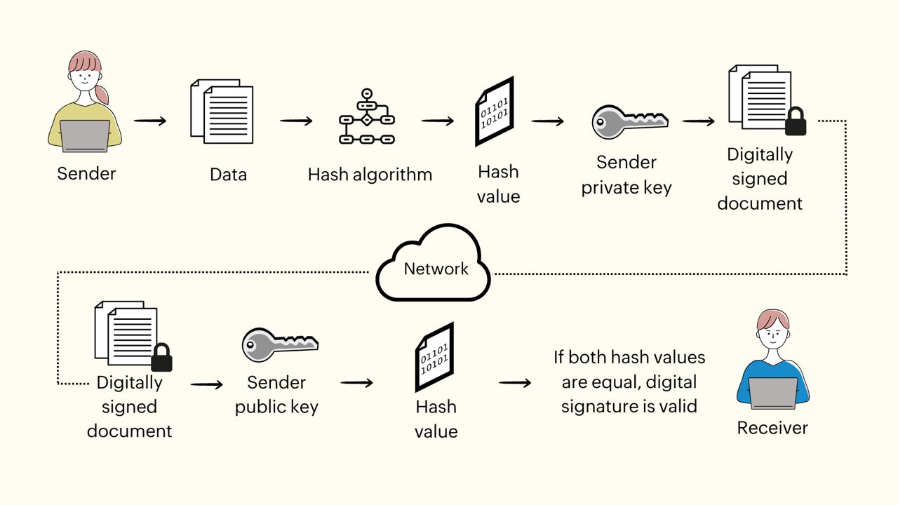
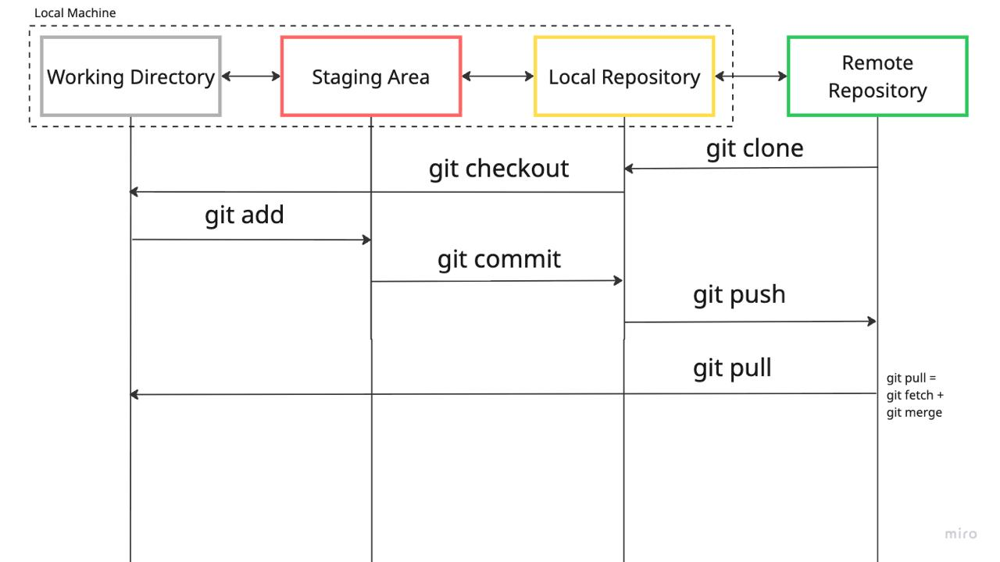

# my-repo — Git learning playground


> Repository for **learning Git**: branching, commits, `rebase`, `merge`, `stash`, PRs, and more.

- [Goals](#goals)
- [Quick Start](#quick-start)
- [Command Cheat Sheet](#command-cheat-sheet)
- [Git Flow Diagram (image)](#git-flow-diagram-image)
- [Mermaid Diagram](#mermaid-diagram)
- [Tasks](#tasks)
- [Useful Links](#useful-links)

---

## Goals
1. Master basic and advanced operations in **Git**.
2. Learn to safely change history (`rebase`/`fixup`/`squash`).
3. Understand branching strategies (**Git Flow**, **Trunk Based Development**).

> **Tip:** commit often → small atomic changes → easier review and rollback.

---

## Quick Start
```bash
git clone https://github.com/pavel-nikolaevich/my-repo.git
cd my-repo
git status
```
## Images



## Bio/nSee [bio.md] for a short biography.
